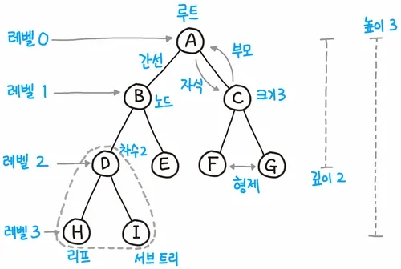
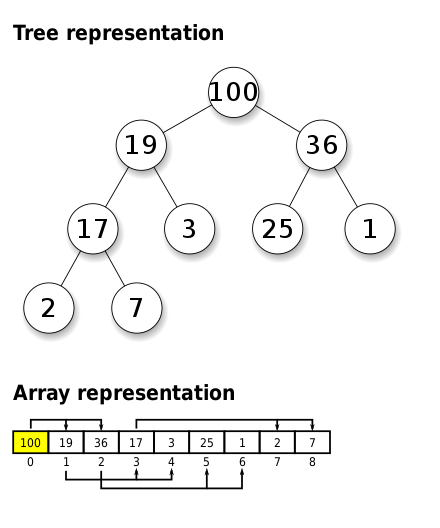
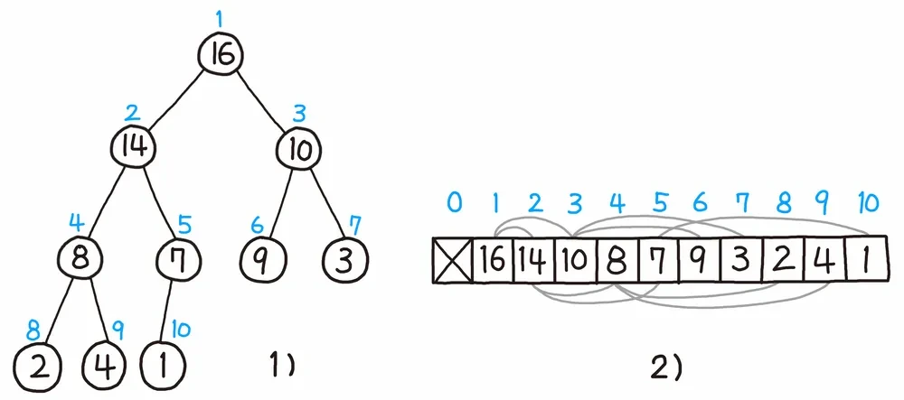

# 용어



트리 구조를 볼 때, 필요한 용어들이다.

# 힙(Heap)이란?



최댓값과 최솟값을 빠르게 찾아내기 위해 만들어진 완전이진트리.

힙에는 **최대힙**과 **최소힙**이 존재한다(위 사진은 최대힙이다).

> 완전이진트리? 마지막 레벨을 제외하고 각 레벨의 노드가 2개씩 '완전' 꽉꽉 채워진 트리 구조

# 힙(Heap)특징

-   최대힙의 조건은 부모 노드가 자식 노드보다 크기가 항상 크다. 최소힙은 최대힙의 반대의 조건을 가진다.
-   형제 노드끼리의 순서는 상관없다.
-   루트 노드는 항상 최댓값이나 최솟값을 가진다.

# 힙(Heap)구현 방식

힙은 위에서 말했듯이 완전 이진 트리로 되어 있기에 배열로 구현하기 매우 좋다.



위 그림을 보면 인덱스(i)를 통해 부모 노드와 자식 노드의 공식이 보이는데 공식은 다음과 같다.

```
왼쪽 자식 노드 : i * 2  
오른쪽 자식 노드 : i * 2 + 1
```

예를 들어, i = 1 이라면

```
왼쪽 자식 노드 : 1 * 2 = 2  
오른쪽 자식 노드 : 1 * 2 + 1 = 3
```

이렇게 접근할 수 있다(자식 노드에서 부모 노드로 접근하려면 자식 노드 인덱스 / 2 를 해주면 된다).

> 위 그림을 보면 0번 인덱스를 비워둔 것을 볼 수 있는데, 아무래도, 곱셈이 들어가다보니 1번 인덱스부터 시작하는게 구현도 쉽고 이해도 잘 된다

내가 최대힙을 구현한 방식을 순서대로 작성해보면 다음과 같다.

```
마지막 부모 노드의 인덱스를 구한다.
loop first
    마지막 부모 노드의 인덱스부터 1번 인덱스까지 반복한다.
    loop second
        부모 노드의 자식 노드들과 비교하여 가장 큰 노드의 인덱스 값을 가져온다.
        가장 큰 인덱스 노드의 값과 부모 노드의 값을 바꿔준다.
        바뀐 자식 노드도 다른 노드의 부모 노드되므로 바뀐 자식 노드부터 돌면서 힙 특징에 만족되게 한다.
```

(최소힙은 작은 노드를 부모 노드로 만들어주면 된다.)

# 힙(Heap)구현 코드

위 구현 방식을 따라 작성한 코드는 다음과 같다.

```
#include <stdio.h>
#include <stdlib.h>

void swap(int *a, int *b){
    int tmp;
    tmp = *a;
    *a = *b;
    *b = tmp;
}

int max(int* tree, int size, int a, int b, int c){
    int max = tree[a];
    int q = a;
    if (b < size && tree[b] > max){
        max = tree[b];
        q = b;
    }
    if (c < size && tree[c] > max){
        max = tree[c];
        q = c;
    }
    return q;
}

int* maxheap(int* tree, int size){
    int nnow;
    int qq;
    int end = size / 2;
    for(int i = end; i >= 1; i--){
        nnow = i;
        while((qq=max(tree, size, nnow, nnow * 2, nnow * 2 + 1)) != nnow){
            swap(&tree[nnow], &tree[qq]);
            nnow = qq;
        }
    }
    return tree;
}

int main(){
    int tree[] = {0, 0, 4, 1, 3, 2, 9, 10, 14, 8, 7};
    int size = sizeof(tree) / sizeof(int);
    int* heap = maxheap(tree, size);
    for (int i = 0; i < size; i++){
        printf("%d ", heap[i]);
    }
    return 0;
}
```

# 출처

- [힙 트리 - 나무위키](https://namu.wiki/w/%ED%9E%99%20%ED%8A%B8%EB%A6%AC )
- [힙 (자료 구조) - 위키백과](https://ko.wikipedia.org/wiki/%ED%9E%99_\(%EC%9E%90%EB%A3%8C_%EA%B5%AC%EC%A1%B0\))
